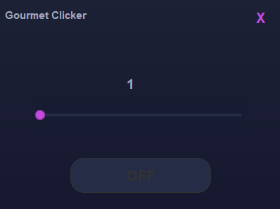

⚠ This program is deprecated. I created it some time ago to explore Java GUI functionalities. A NEW VERSION is now available in C++. [Click here to access it](https://github.com/ItalianG0urmet/GourClicker-plus-plus). ⚠

# Autoclicker Java

A simple autoclicker written in Java in just 2 days. This project was created to practice working with GUIs and includes adjustable options, including a mode designed to simulate human clicks.

## Features

- **Intuitive GUI**: A simple and easy-to-use user interface.
- **Adjustable Options**: Customize the click frequency and duration.
- **Bypass Mode**: Simulate realistic human clicks with random variations.

## Screenshot

## Usage

1. Start the application.
2. Use the controls in the GUI to set the click frequency and duration.
3. Select the bypass mode to simulate more realistic clicks.
4. Press "on/off" to begin and stop the autoclicker.
5. You can also activate and deactivate the autoclicker by pressing the mouse wheel.

### Author

- **Italian_Gourmet** - [ItalianG0urmet](https://github.com/ItalianG0urmet)

Feel free to contact me with any questions or suggestions!

---

